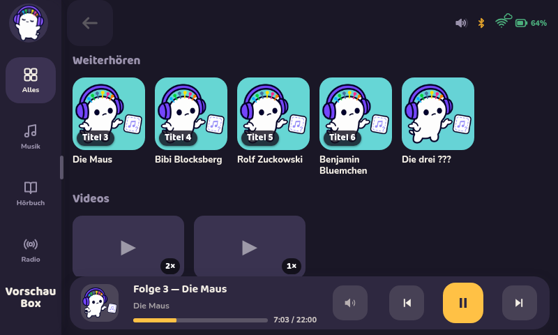
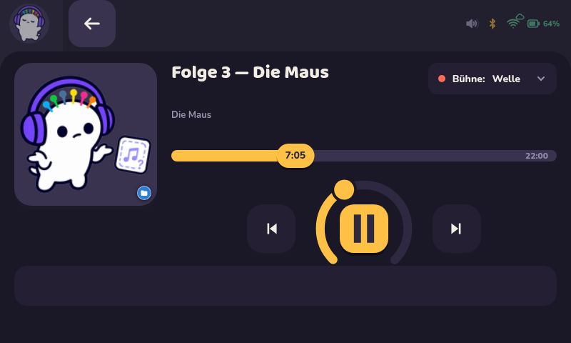
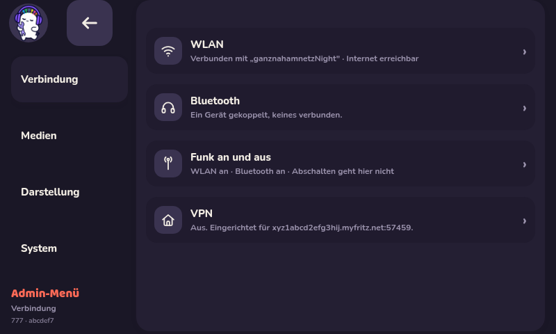
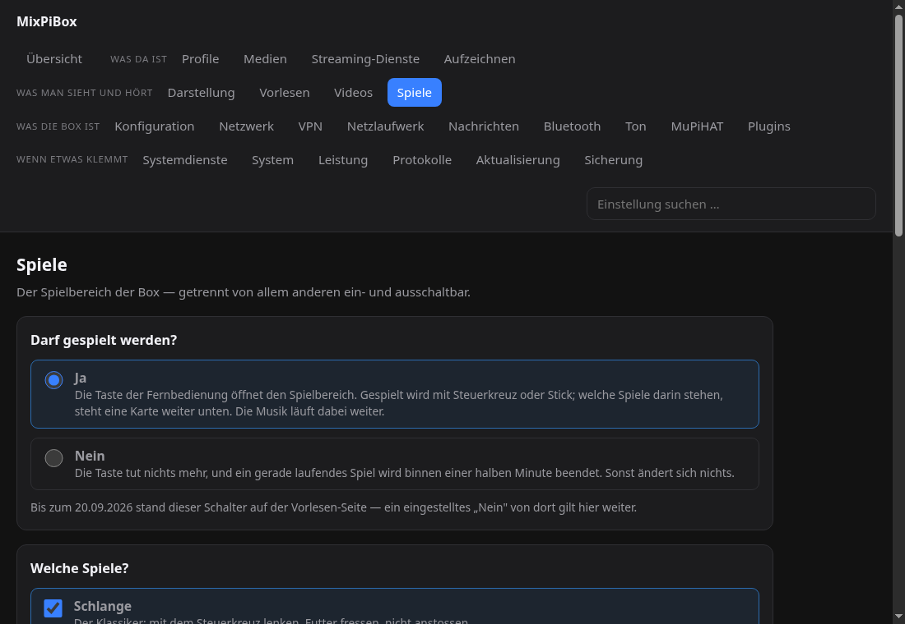
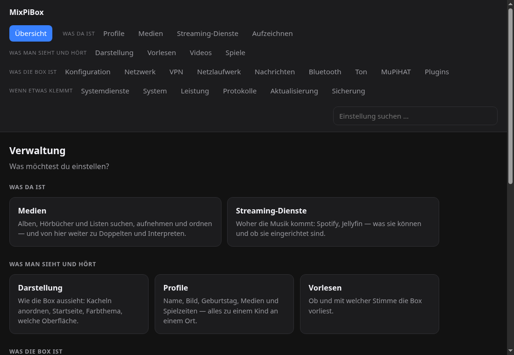
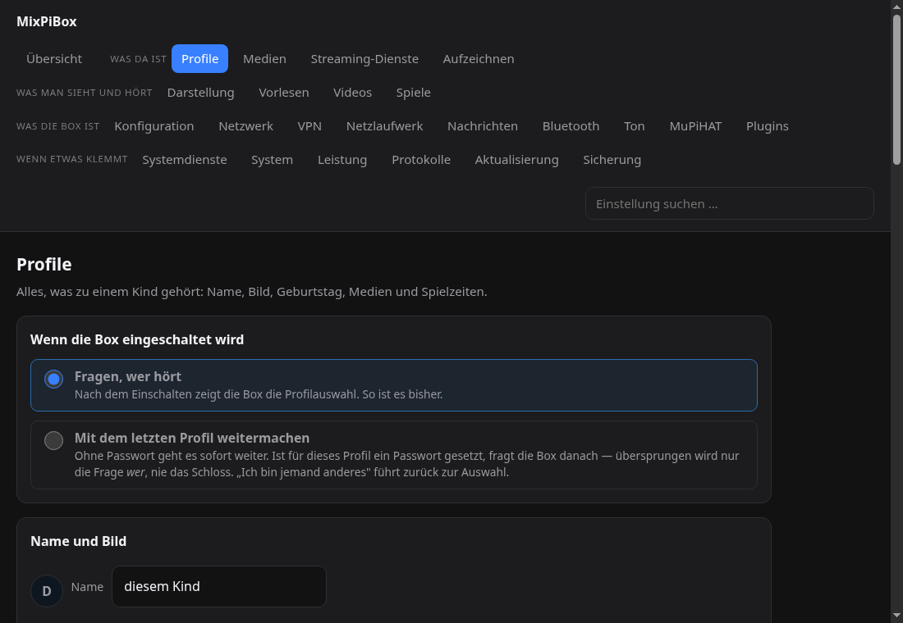
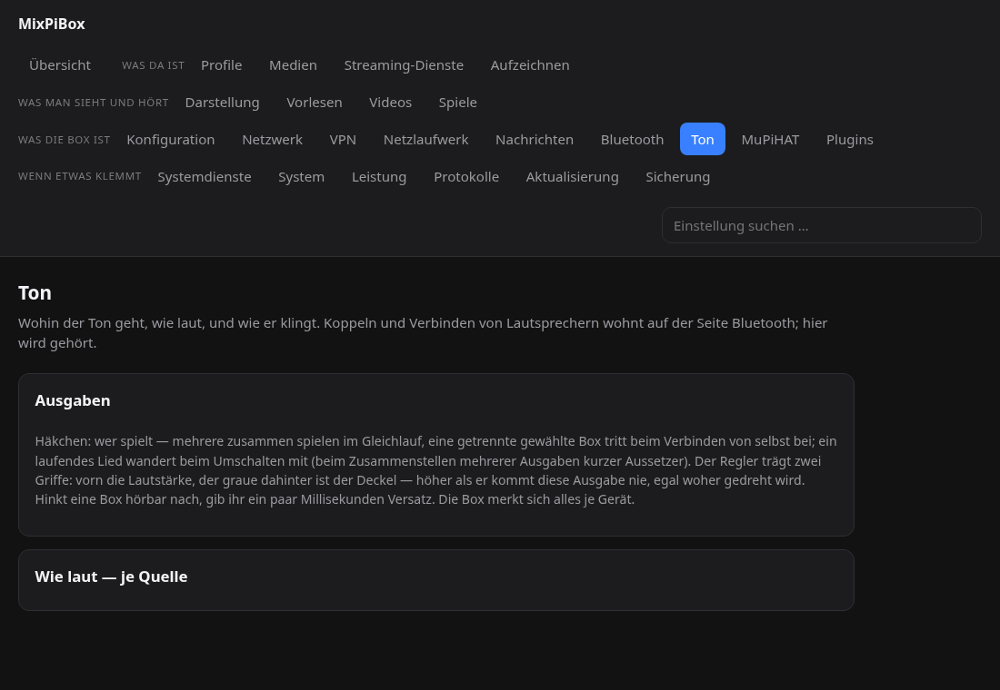
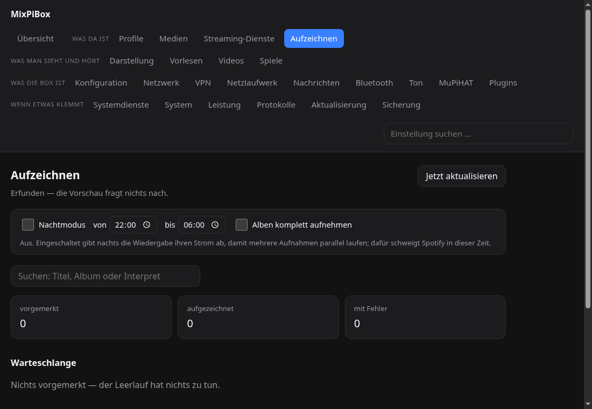
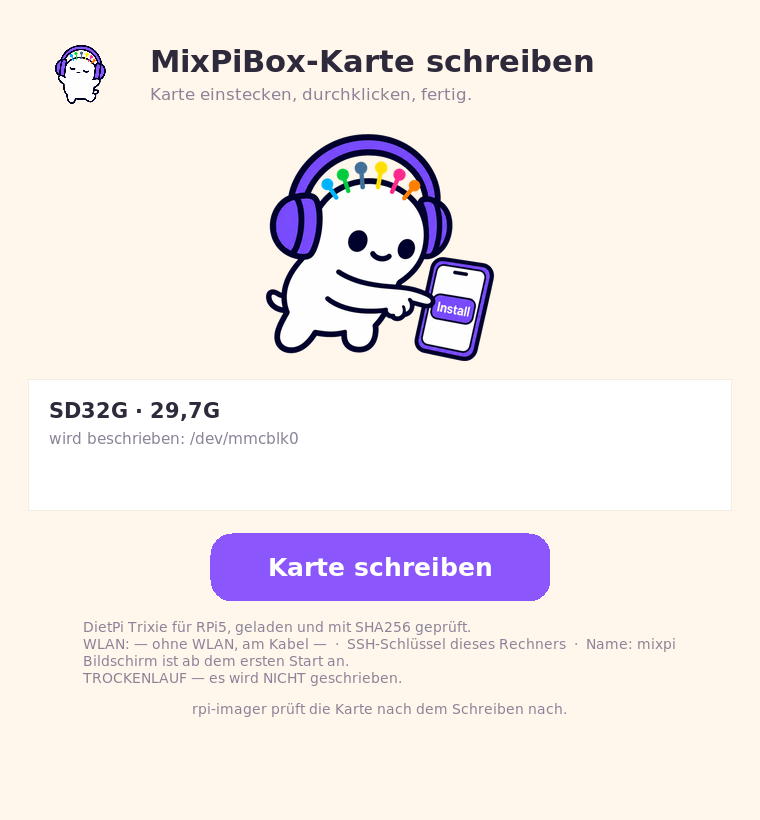
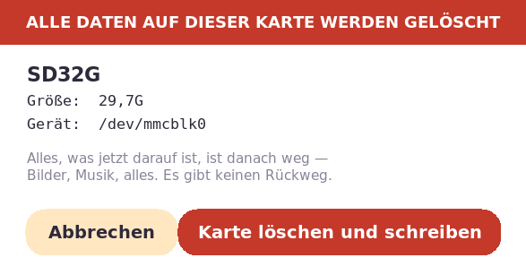

# MixPiBox

*English edition: [README.en.md](README.en.md)*


**Eine Musikbox für Kinder auf einem Raspberry Pi.** Touchscreen, Lautsprecher,
keine Tastatur. Ein Kind tippt auf ein Cover, und es spielt — aus Spotify, aus
Jellyfin, von der Platte, aus einer Mediathek oder aus einem Radiostream.

> **This is a hard fork of [MuPiBox](https://mupibox.de) by *splitti* and *nero*.**
> Compatibility with the original is broken on purpose and is not being restored.
> If you are looking for the original project, go to
> **https://github.com/splitti/MuPiBox** — not here.
> This fork's documentation is in German (see *Warum diese Datei auf Deutsch ist*
> at the bottom). Credits and license of the original are kept below.



---

## 1. Dies ist ein Fork — und was das heißt

Die MixPiBox ist eine Abzweigung der [MuPiBox](https://mupibox.de) von
*splitti* und *nero*; die eigene Arbeit beginnt am 23.07.2026 auf einem Stand
um Upstream 4.2.4. **Der Fork ist hart:** Kompatibilität zum Ursprung wird
nicht angestrebt und ist gebrochen (BACKLOG.md, Abschnitt *Fork-Status*).
Unterhalt und Schäden liegen hier.

| | |
|---|---|
| **Du willst eine fertige Musikbox mit Releases und Gemeinschaft** | → https://mupibox.de |
| **Du suchst diesen Fork** | → Du bist hier richtig. Kein Support, keine Releases — aber eine **Installationsanleitung von Grund auf** (Abschnitt 5). |

Der Ursprung führt inzwischen zwei Linien — **Classic** (Release 5.0.1 vom
21.09.2026) und das angekündigte, nicht veröffentlichte **NG**. Dieser Fork ist
keins von beiden, sondern ein eigener Neubau aus derselben Idee. Was NG
ankündigt und es hier nicht gibt: RFID, Tasten als Bedienweg, eine App. Was es
hier gibt, steht in Abschnitt 3; der Vergleich in Abschnitt 4 misst gegen den
Stand der Abzweigung, nicht gegen Classic 5.

Fehler dieses Forks gehören in dieses Repo — nicht in die Kanäle des Ursprungs,
dessen Leute diesen Code nie gesehen haben.

---

## 2. Was zuletzt dazugekommen ist

Aus dem Commit-Log, nicht aus dem Gedächtnis. Was davon halb ist, steht in 3.9.

* **25.09.** **Kinderzeit-Regeln je Kind** jetzt auch in der Verwaltung: je Kind
  „wie die Hausregel" oder eigene Regeln. Der Ein-Knopf-Weg richtet Vorlesen,
  Fernbedienung, Entzerrer und die Mitschnitt-Senke ein wie die anderen Wege.
* **21.09.** Nachrichten an das Kind — nur von Absendern auf der Liste, angezeigt
  dort, wo das Kind hinsieht.
* **20.09.** Ein **Netzlaufwerk** (SMB oder WebDAV) als Ablage für Sicherungen
  und Mitschnitte, mit Zertifikatswarnung statt stillem Durchwinken.
* **20.09.** **Belohnungs-Videos**: eine Seite, auf der Eltern Videos verdienen
  lassen; der Kern führt Buch je Kind; ein 25-Minuten-Video lässt sich in Stücke
  schneiden. Dazu die **zweite Mediathek** (ZDF, KiKA, 3sat, arte, funk).
* **20.09.** Die **Spielecke** hat vier Spiele statt einem, Eltern schalten
  jedes einzeln, und die Spielstimme sagt Karten und Farben an. Ein Tipp auf die
  Uhr sagt die Zeit.
* **20.09.** Die Box ist im Netz **auffindbar** (`<name>.local`) — auf zwei der
  drei Ausrollwege; der Monolith hinkt nach.
* **20.09.** Start-Modus: **beim Einschalten weitermachen** statt fragen, ohne
  das Schloss zu überspringen.
* **06.09.** **Fernbedienung und Xbox-Controller** steuern die Box — exklusiver
  Griff am Eingabegerät, Geräteprofile mit Schemata, die Spielecke auf der
  Share-Taste. Verschmelzung wird zur Vorgabe.
* **05.09.** Die **Bühne** über den Spieltasten: mitlaufender Songtext (LRCLIB),
  Umschalter im Player und eine Taste am Controller.
* **August:** Profile mit Schloss, Kinderzeit je Kind, Abspielstatistik (seit
  15.08.), Aufnahme aus Spotify, systemd statt pm2, Cover auf der Box, das
  Plugin-System mit Verwaltungsfläche.

---

## 3. Was die Box kann

Alles hier ist am Bestand abgelesen oder am Gerät gemessen, nicht versprochen.
Was erst halb da ist, steht in 3.9 — und nur dort.

### 3.1 Für das Kind — der Schirm

* **Kacheln statt Text.** Cover antippen, es spielt. Wer nicht liest, kommt
  trotzdem überall hin.
* **Quellen nebeneinander:** Spotify (librespot oder Soloist, der offizielle Client),
  Jellyfin, Dateien auf der Box, Radiostreams, Podcasts, Archive.org, Subsonic
  und die **Mediatheken** von ARD, ZDF, KiKA, 3sat, arte und funk. Alles
  außerhalb des Kerns ist ein **Plugin** (Abschnitt 7).
* **Dasselbe Album aus mehreren Diensten wird EINE Kachel.** Seit dem
  06.09.2026 ist das die Vorgabe: am Gerät gemessen wurden aus 44 Kacheln 35 —
  neun Werke lagen doppelt im Regal, eines sechsfach. Titel, Interpret und Bild
  setzt die Box feldweise zusammen (Spotify → Jellyfin → lokal); **abgespielt**
  wird in der umgekehrten Reihenfolge (lokal → Jellyfin → Spotify), damit ein
  Ausfall nicht durchschlägt. Zusammengelegt wird nur auf Knopfdruck, jede
  Zusammenlegung ist einzeln trennbar, und ein getrenntes Paar bleibt getrennt.
* **Weiterhören** — „wo war ich stehengeblieben?", die Frage, die sonst niemand
  beantwortet. Dazu **Interpretenseiten**: alle Alben eines Interpreten, nicht
  nur die, die zufällig in einer Playlist stecken.
* **Die Bühne über den Spieltasten** kennt vier Zustände: aus · Wellen ·
  **Text** (mitlaufender Songtext mit Zeitmarken, Quelle LRCLIB über ein
  Plugin) · Titel des Albums. Vorgabe ist *aus*. Für Hörspiele findet sich
  meist kein Text — das ist der Normalfall und wird als solcher gemeldet
  (gemessen 05.09.2026: Pop 5/5, Kinderlied 3/5, Hörspiel 0/5).
* **Vorlesen.** Ein Tipp auf eine Kachel liest den Namen vor, im **Lernmodus**
  Silbe für Silbe. Gerechnet wird auf der Box (Piper), ohne Netz. Eingerichtet
  wird Piper auf allen drei Ausrollwegen; scheitert dabei der Download (rund
  244 MB), fällt die Box auf die Browser-Stimme (espeak-ng) zurück.
* **Profile.** Bis zu zwölf Kinder, jedes mit Name, Figur, Geburtstag und
  eigenen Ablagen (Verlauf, Weiterhören, Listen, Medienauswahl, Aussehen,
  Videofreigaben, Zeitverbrauch). Angemeldet wird ohne Tastatur: ein Fenster
  „Wer hört?" mit großen Figurkacheln, auf Wunsch mit einem Schloss aus
  Zeichen, Zahlen, Farbpunkten, Muster oder **Bildern** — geprüft im Server
  (bcrypt), mit wachsender Wartezeit gegen das Durchprobieren. Der **Gast** ist
  ein schaltbares Konto; solange er an ist (Vorgabe), startet die Box ohne zu
  fragen.
* **Aussehen:** Farbsätze, fünf frei wählbare Farben, hell/dunkel — je Profil.
* **Drei Anzeigeorte** für dasselbe Stück: das Kissen am unteren Rand, der
  aufgezogene Spieler und das formatfüllende Cover.
* **Der Eltern-Bereich** liegt hinter langem Halten und einem Zahlentor, damit
  ihn niemand versehentlich aufmacht — das Nötigste direkt an der Box, alles
  Weitere in der Verwaltung (3.3).




### 3.2 Spielen und Lernen

Zwei getrennte Spielorte, und das ist Absicht: die **Schublade** am Touchscreen
(für den Finger) und die **Spielecke** im Vollbild (für Steuerkreuz oder
Controller, siehe 3.7).

| Ort | Spiel | Was das Kind übt |
|---|---|---|
| Schublade | **Memory** | Merken; vier Spielarten, auch zu zweit — ohne einen einzigen Titel spielbar (6 mitgelieferte Kartensätze, 53 CC0-Bilder aus Museen) |
| Schublade | **Puzzle** | Räumliches Vorstellen; Schiebepuzzle 3×3 aus einem Cover der eigenen Bibliothek, gemischt mit echten Zügen (ein gewürfeltes Brett wäre jedes zweite Mal unlösbar) |
| Schublade | **Rechnen** | Kopfrechnen bis 10, Plus und Minus, drei Antworten zur Wahl — Ziffern erkennen genügt |
| Schublade | **Uhr** | Uhrzeit ablesen (volle und halbe Stunden, „halb 4" = 3:30); ein Tipp liest die Antwort vor |
| Schublade | **Lesen** | Leseanfang: ein Wort groß, auf Tipp Silbe für Silbe vorgelesen — die Wörter sind die Titel der eigenen Bibliothek |
| Schublade | **Malen** | Nichts. Die einzige App ohne richtig und falsch — für das Kind, das gerade keine Aufgabe will |
| Spielecke | **Schlange** | Auge-Hand-Koordination, vorausschauendes Lenken |
| Spielecke | **Paare** | Merken und, mit Spielstimme, Wortschatz — die Box sagt jede Karte an |
| Spielecke | **Drei gewinnt** | Regeln, Vorausdenken, Verlieren können |
| Spielecke | **Farben merken** | Merkspanne und Farbwörter |

Eltern schalten **jedes Spiel einzeln** an und aus (Verwaltung → Spiele), dazu
den ganzen Spielbereich und die Spielstimme. Alle zehn laufen **ohne Netz**.




### 3.3 Für die Eltern — die Verwaltung unter `/admin`

27 Seiten plus Anmeldung, mit einer **Suche über alle Einstellungen**. Sie ist
die einzige Verwaltung der Box — der geerbte PHP-Admin ist am 19.08.2026
ausgebaut worden.



| Bereich | Seiten |
|---|---|
| Was da ist | Profile · Medien · Streaming-Dienste · Aufzeichnen |
| Was man sieht und hört | Darstellung · Vorlesen · Videos · Spiele |
| Was die Box ist | Konfiguration · Netzwerk · VPN · Netzlaufwerk · Nachrichten · Bluetooth · Ton · MuPiHAT · Plugins |
| Wenn etwas klemmt | Systemdienste · System · Leistung · Protokolle · Aktualisierung · Sicherung |

Die Tabelle zeigt die Kopfleiste; dazu kommen die Übersicht und drei
Unterseiten (Doppelte, Interpreten, Erweiterung), die man über ihre
Mutterseite erreicht.



### 3.4 Ton

Der Ton läuft über PipeWire durch eine Kette aus zwei überspringbaren
Stationen: **Quellen → Klangwerk → Entzerrer → Ziel**.

* **Mehrere Bluetooth-Senken gleichzeitig.** Die Kombi-Senke „Überall" spielt
  auf allen verbundenen Lautsprechern zugleich, der eingebaute darf mitspielen,
  und je Gerät ist ankreuzbar, ob es mitkommt. PipeWire gleicht die Laufzeiten
  an; zusätzlich lässt sich je Box ein Versatz von 0–1000 ms nachstellen.
* **Fünfband-Entzerrer** als eigene Filterkette (Kuhschwanz 100 Hz, Glocken
  250/1000/4000 Hz, Kuhschwanz 10 kHz), zur Laufzeit stellbar, mit gerechnetem
  Frequenzgang und Übersteuerungswarnung ab +1 dB in der Verwaltung.
  **Automatisch misst er nichts ein** — es gibt keinen Auto-EQ.
* **Klangwerk** davor: **Stereobasis/Spreizung** (100 = unverändert bis 0 =
  Mono — der Hebel gegen seitlich abstrahlende Lautsprecher, den kein Equalizer
  bietet), Hoch-/Tiefpass, Kuhschwänze, Vorpegel, **Kompressor und Begrenzer**
  gegen den Sprung vom Flüstern zum Knall und zum Schutz der 3-W-Chassis.
  Beschrieben wird die Kette von Ton-Plugins aus einer geschlossenen Liste —
  kein freier PipeWire-Text.
* **Lautstärke je Quelle** (Spotify, mpv, Browser) und **je Ausgabe**, dazu ein
  Höchstpegel und ein festgenagelter Pegel je Bluetooth-Box; eine Wache stellt
  beides nach Reconnect und Neustart wieder her.
* **Musik tritt zurück**, während vorgelesen wird (alles außer der Stimme auf
  45 % — leiser statt anhalten).
* Ziel ist der eingebaute MuPiHAT-Verstärker (MAX98357A über I²S, **nicht**
  hifiberry), ein bestimmter Bluetooth-Lautsprecher oder „Überall".



### 3.5 Zeit, Belohnung, Statistik — und ohne Netz

* **Kinderzeit.** Je Wochentag frei oder gesperrt, ein Zeitfenster von–bis und
  eine Tagesdauer in Minuten. Entschieden und gezählt wird **serverseitig**;
  gezählt wird nur, was wirklich klingt. Am Ende darf der laufende Titel noch
  bis zu fünf Minuten zu Ende gehen, dann hält die Box selbst an. Eltern können
  für heute Minuten schenken oder den Tag zurücksetzen. Eine kaputte
  Konfiguration sperrt **nicht** aus, sie wird auf die freundliche Seite
  gebogen.
* **Belohnungs-Videos.** Eltern geben einzelne Mediathek-Videos frei, mit
  Anzahl; das Kind sieht nur das Freigegebene — keine Suche, kein Stöbern.
  Verbraucht wird erst bei rund 90 % Gesehenem, ein Abbruch kostet nichts. Ein
  Video lässt sich in **Stücke** schneiden, jedes mit eigenem Zähler. Videozeit
  geht **nicht** vom Hörguthaben ab.
* **Abspielstatistik.** Was wann wie lange und über welchen Dienst lief —
  gemessen am Herzschlag der Oberfläche, nicht von Start bis Stopp. Zeitraum
  heute/7/30/365 Tage, je Kind oder über alle. Läuft seit dem 15.08.2026 mit;
  rückwirkend gibt es die Zahlen nicht, und die Seite sagt das.
* **Boot-Statistik.** Die Seite „Leistung" zeigt Kernel- und Userland-Startdauer,
  die zehn größten Bremser und eine Zeitachse des Starts. Es sind die Zahlen des
  **letzten** Starts, kein Mittel über mehrere.
* **Ohne Netz** bleibt die Box benutzbar: ein Dienst tauscht die Medienliste
  gegen eine gefilterte (Spotify, Radio, Podcasts und die ARD-Audiothek fallen
  weg, lokale Dateien und Jellyfin bleiben), die **Cover liegen auf der Box**
  (gemessen 1,69 s kalt → 0,03 s danach), und die Ansagen spricht die Box selbst.



### 3.6 Aufnehmen

Das Plugin `mixpi-mitschnitt` greift den Ton am PipeWire-Knoten des
Spotify-Abspielers ab und legt ihn als FLAC in den Medienordner — aus dem
Mitschnitt wird eine ganz normale lokale Kachel. Statt passiv mitzuschneiden
merkt die Box angespielte Titel **vor** und nimmt sie später im Leerlauf
vollständig auf.

Das ist ausdrücklich eine **Testfunktion**: standardmäßig aus, je Dienst ein
eigener Schalter, und ohne einen zweiten Haken zur Rechtslage schneidet gar
nichts mit. Aufnehmbar ist heute nur Spotify.

### 3.7 Bedienen ohne Touch — Fernbedienung und Controller

Die Box lässt sich über gekoppelte **Bluetooth-Eingabegeräte** bedienen, ohne
den Schirm zu berühren. Ein eigener Dienst liest `/dev/input/event*` mit der
Python-Standardbibliothek, **ohne X und ohne Kiosk-Browser**, und nimmt das
Gerät exklusiv (sonst schluckt Chromium die Tasten).

* Vier Geräteprofile: **Fire TV** (Alexa-Fernbedienung und Basic), **Google TV
  /Chromecast** und der **Xbox Wireless Controller** — letzterer am Gerät
  ausgemessen (06.09.2026). Die mitgelieferte Zuordnung deckt Fire TV und den
  Controller ab; Google TV wird von Hand zugeordnet (3.9).
* 16 Box-Aktionen mit stabiler Kennung (Abspielen/Pause, Titelwechsel, Stoppen,
  lauter/leiser, hoch/runter/links/rechts, auswählen, Startseite, zurück,
  ausschalten, Bühne weiterschalten, Spielecke öffnen).
* Ausgelieferte Controller-Belegung: A = auswählen, B = zurück, X =
  Abspielen/Pause, Y und Menü = Startseite, LB/RB = Titelwechsel, View =
  Bühne weiter, **Share = Spielecke öffnen** (den einzigen Weg dorthin).
* Erkannt wird am **Namen**, nie an der event-Nummer — die ist nach jedem
  Wiederverbinden eine andere. Entprellt wird getrennt: Tasten 250 ms, Achsen
  50 ms.
* **Grenze:** es steuert immer nur *ein* Gerät gleichzeitig, und ein neues
  Gerät wird heute von Hand zugeordnet (siehe 3.9).

### 3.8 Unter der Haube

* **Zwei Backends in TypeScript:** `src/backend-api` (Medien, Konfiguration,
  Verwaltung, liefert die Oberfläche aus, Port 8200, 142 Testdateien) und
  `src/backend-player` (mpv für lokal/Jellyfin, Spotify-Steuerung, Port 5005,
  15 Testdateien).
* **42 systemd-Einheiten** in `config/services` (35 `.service`, 6 `.timer`,
  1 `.path`) — statt pm2. Die App ist damit 20 s früher bereit.
* **14 Plugins** im Baum, in eigenen Worker-Fäden mit Speicher- und
  Zeitgrenzen (Abschnitt 7).
* **Sicherung** mit einem Rückweg, der ohne SSH auskommt: eine Textdatei auf
  der FAT-Partition der Karte genügt.
* **Nachrichten an die Box** (Matrix, Signal, Telegram) und ein
  MQTT-Dienst für Home Assistant — geerbt und in Betrieb.
* **Tests:** Die Verwaltung hat Zeugen für Anmeldeweg, Kinderzeit, die Suche
  und einige weitere Seiten — längst nicht für jede. Die Box-Oberfläche hat
  Verhaltenstests für Abspielweg und Zustände, **nicht** fürs Aussehen.

### 3.9 Was halb fertig ist

Damit niemand darauf baut — die lange Fassung steht in
`dokumentation/mixpibox.md`, Abschnitt 9. Der Plan, nach dem dieser Abschnitt
verschwindet, steht in `BACKLOG.md`, E143 (nachgeprüft am 25.09.2026):

* **Die Anmeldung greift nur bei abgeschaltetem Gast.** Solange der Gast an ist
  — die Vorgabe —, startet die Box wortlos im zuletzt aktiven Profil, auch wenn
  es ein Schloss hat, und der Start-Modus hat keine Wirkung.
* **Ein neues Eingabegerät zuzuordnen ist Handarbeit.** Die Verwaltungsseite
  dafür fehlt; die Geräteprofile samt SVG-Schemata legen seit dem 25.09.2026
  alle drei Ausrollwege ab, eine Route, die die Zuordnung schreibt, gibt es
  noch nicht.
* **Der Einrichtungsassistent räumt nicht hinter sich auf.** Der Weg übers
  Handy (eigenes WLAN, QR, Seite fürs Handy) ist verdrahtet und am Pi 5
  durchgespielt, am Pi 4 nicht. Nach der Einrichtung bleiben aber der
  Installations-Agent im Netz und der Vorstart eingeschaltet — eine fertige
  Box, die ohne Router startet, öffnet wieder das Einrichtungs-WLAN.
* **Der Lautstärkesprung beim Quellenwechsel** ist real und nicht
  ausgeglichen, wenn Spotify über Soloist spielt: lokale Dateien laufen über
  ReplayGain, Soloist kennt keine Normalisierung. librespot (die Vorgabe)
  normalisiert; gleich laut ist damit nicht gemessen.

---

## 4. Was diese Abzweigung anders macht

Verglichen wird gegen den Stand, von dem sie abzweigte (Upstream 4.2.4,
05.05.2026) — nicht gegen Classic 5, das seit dem 20.09.2026 eigene Wege geht.
Die dritte Spalte ist die wichtige: sie zwingt dazu, Halbfertiges als
halbfertig zu benennen, statt es wegzulassen (dann fehlt es) oder mitzuzählen
(dann lügt die Liste).

| Was | Wo | Stand |
|---|---|---|
| **Eine neue Box-Oberfläche** — reines HTML/CSS/JS, kein Bundler, keine Abhängigkeit, keine externe Adresse. Ausgeliefert unter `/neu/`. | `NewDesign/` (rund 50 000 ausgelieferte Zeilen) | in Benutzung |
| **EINE Box-Oberfläche.** Der Erprobungs-Umschalter fiel mit E118/1d, die alte Angular/Ionic-Oberfläche wurde mit E118/1e am 05.09.2026 **gelöscht**; der Kiosk lädt fest `/neu/`. In `src/frontend-box/` liegt nur noch ein Nachzügler-Modul samt `LIESMICH.md`. | `scripts/chromium-autostart.sh`, Catch-all in `src/backend-api/src/server.ts` | fertig |
| **Neue Verwaltung** in Angular, 27 Seiten + Anmeldung, unter `/admin`, mit Suche über alle Einstellungen. | `src/frontend-admin/` | löst den PHP-Admin ab (ausgebaut 19.08.2026); Zeugen für Anmeldeweg, Kinderzeit, Suche und einige weitere Seiten |
| **Backends in TypeScript** statt gewachsenem JS/PHP. | `src/backend-api/` (142 Testdateien), `src/backend-player/` (15) | in Benutzung |
| **Profile für mehrere Kinder** — bis zwölf, mit Figur, Geburtstag, Schloss in fünf Eingabearten und eigenen Ablagen je Kind. | `src/backend-api/src/profile.ts`, `NewDesign/app.js` | fertig; die Anmeldung greift nur bei abgeschaltetem Gast (3.9) |
| **Kinderzeit** — wie lange, wann und an welchen Tagen; serverseitig gezählt, nicht im Browser. | `src/backend-api/src/kinderzeit.ts` | fertig; Regeln je Kind seit 25.09.2026 auch in der Verwaltung |
| **Belohnungs-Videos** — Eltern geben einzelne Mediathek-Videos frei, in Stücken, mit Zähler. | `NewDesign/video.js`, Verwaltungsseite „Videos" | fertig |
| **Spiele und Lernen** — sechs Apps in der Schublade, vier Spiele in der Spielecke, jedes einzeln abschaltbar. | `NewDesign/apps.js`, `NewDesign/app.js`, `src/backend-api/src/spiele.ts` | fertig |
| **Bedienung per Fernbedienung/Controller** — vier Geräteprofile, 16 Aktionen, ohne X. | `scripts/box/fernbedienung.py`, `config/fernbedienungen/` | fertig; die Zuordnungsseite fehlt (3.9) |
| **Verschmelzung mehrerer Quellen** — dasselbe Album aus Spotify *und* Jellyfin wird EINE Kachel, seit 06.09.2026 als Vorgabe. | `src/backend-api/src/verschmelzung.ts` | fertig, am Gerät gemessen (44 → 35 Kacheln) |
| **Interpretenseiten** und **Weiterhören** — alle Alben eines Interpreten; „wo war ich stehengeblieben?". | `src/backend-api/src/interpretenseite.ts`, `weiterhoeren.ts` | fertig, getestet |
| **Eine Tonkette, die man stellen kann** — mehrere Bluetooth-Senken zugleich, Fünfband-Entzerrer, Stereobasis, Kompressor/Begrenzer, Lautstärke je Quelle. | `config/templates/61-entzerrer.conf`, Plugin `mixpi-klang`, Verwaltungsseite „Ton" | fertig; kein Auto-EQ, Lautheit zwischen den Diensten mit Soloist offen (3.9) |
| **Cover liegen auf der Box.** Gemessen: 1,69 s kalt → 0,03 s danach. | `src/backend-api/src/server.ts` (`coverspeicher`) | fertig (Classic hat das seit 5.0.0 ebenfalls) |
| **systemd statt pm2** — 20 s früher bereit; seit 14.08.2026 auf **allen** Wegen. | `config/services/` | umgestellt |
| **Ein Plugin-System** — alles jenseits des Kerns ist ein Plugin, ohne Bau-Schritt, in einem eigenen Worker-Faden. | `plugins/` (14 Stück) | in Benutzung; eine eigene Fläche im Kinderschirm fehlt bewusst (Abschnitt 7) |
| **Eigener Installationsweg** — der alte Monolith fror bei ~69 % ein, ohne Abbruchmöglichkeit. Ersetzt durch einen schrittweisen Fern-Installer, der seit 08.08.2026 **in diesem Baum** liegt ([ZUGEZOGEN.md](ZUGEZOGEN.md)). | `remote-step-installer/` | in Benutzung; `autosetup/autosetup.sh` lebt daneben weiter, und `scripts/make-boot-sd.sh` packt seit dem 23.09.2026 nur noch, was autosetup liest — 14 MB statt 164, mit librespot (bis dahin schloss es `bin/librespot` aus, worauf autosetup hart abbrach) |

### Der Unterbau — am Fork-Punkt und heute

Gemessen an `autosetup/autosetup.sh` des Fork-Punkts (Upstream 4.2.4, 605
Zeilen) und an den heutigen Rezepten:

| Baustein | Ursprung 4.2.4 | MixPiBox heute |
|---|---|---|
| Betriebssystem | DietPi | DietPi auf Debian 13 „Trixie" |
| Node.js | 22 (nodesource) | **26** (nodesource) |
| Prozesse | pm2 | **systemd**, 42 Einheiten |
| Tonsystem | PulseAudio | **PipeWire + WirePlumber**, LADSPA-Glieder |
| Abspieler lokal/Jellyfin | mplayer | **mpv** |
| Spotify | librespot (Entwicklungsstand 0.6, 08/2025) | **librespot 0.8.0** oder **Soloist** |
| Verwaltung | PHP auf lighttpd | **Angular**, ausgeliefert vom Node-Backend |
| Kinderoberfläche | Angular/Ionic, mit Bau-Schritt | **HTML/CSS/JS** ohne Bundler |
| Kiosk | Chromium | Chromium, **Cog/WPE** als Option |
| Installation | ein Monolith-Skript | **Rezepte**, Schritt für Schritt; Selbstlauf von der Karte |
| Sprachausgabe | — | **Piper** auf der Box |
| Erweiterungen | — | **Plugin-System**, 14 Plugins |

### Gemessen — was der Umbau gebracht hat

Alle Zahlen am Gerät, mit Datum; Streuung zwischen zwei gleichen Starts rund
eine Sekunde. Die Messungen stehen im Wissenspaket
(`mupi-startzeiten-gemessen`, `mupi-boot-32s-auf-13s`,
`grundmessung-zeit-bis-zum-bild`).

| Was | vorher | nachher | Gerät, Datum |
|---|---|---|---|
| **App bereit** (Backend antwortet auf :8200) | ~23,5 s mit pm2 | **3,3 s** mit systemd | Pi 4 und Pi 5, 29.07.2026 |
| **Boot** (Kernel + Userspace), Pi 4 | 31,8 s | **~15 s** | 29.07.2026 — der DHCP-Rückfall allein kostete 18 s |
| **Boot**, Pi 5 | 18,2 s | **13,4 s** | 29.07.2026 |
| **Fenster steht**, Pi 4 | 34,9 s | **25,1 s** | 29.07.2026 |
| **Cover laden** | 1,69 s kalt aus dem Netz | **0,03 s** von der Box | Cover-Speicher |
| **Kiosk-Speicher** (PSS) | Chromium + X: 458–540 MB je nach Zeitpunkt | **Cog: 331 MB** (−180 bis −230 MB) | Pi 5, 19.09.2026 |
| **Zeit bis zum Bild**, Kaltstart Pi 5 | — | 19–24 s, davon 4–9 s Warten auf DHCP | 04.08.2026 |

Was daran **nicht** besser wurde, steht ehrlich dabei: die rund 9 s, die
Chromium vom Prozessstart bis zum fertigen Bild braucht, sind echte Arbeit und
bleiben; und der Lautstärkesprung zwischen den Diensten ist mit Soloist nicht
ausgeglichen (3.9).

---

## 5. Installation von Grund auf

> **Ohne Gewähr.** Dieser Fork hat keinen Support (Abschnitt 1). Die Anleitung
> beschreibt den Weg, den der Betreiber selbst fährt — sie ist keine Zusage,
> dass er auf fremder Hardware durchläuft.

### 5.1 Was man braucht

**Am Gerät:**

* **Raspberry Pi 5** oder **Pi 4** (beide arm64). DietPi kennt kein „RPi4" —
  das Abbild für Pi 2/3/4/Zero 2 heißt dort `RPi234`; der Installer wählt es
  selbst.
* **SD-Karte** (die Boot-Partition muss das Installationspaket fassen:
  gemessen 13,8 MB bei 94 MB frei).
* **DSI-Touchscreen 800 × 480.** Diese Auflösung ist die Vorgabe für jedes
  Bild, das auf der Box entsteht.
* **Ton:** MuPiHAT (MAX98357A über I²S — *nicht* hifiberry) oder ein
  Bluetooth-Lautsprecher.

**Am Rechner, der die Karte schreibt:** Python 3 mit Tkinter, **PyYAML**
(dazu gleich mehr), Administrator- bzw. Root-Rechte und Netz.

### 5.2 Schritt 1 — das Repo holen

```bash
git clone https://github.com/scoutr2d2/mixpibox.git
cd mixpibox
```

**Der Pfad ist beliebig.** Die Rezepte holen die Dateien der App aus
`${MUPI_REPO:-$HOME/Downloads/mixpibox}`, und der Installer findet den Ordner
selbst: er liegt ja *in* ihm (`remote-step-installer/` ist Teil dieses Baums).
Gesucht wird in dieser Reihenfolge — `--fork <pfad>`, `$MUPI_REPO`, der
Elternordner des Installers, `~/Downloads/mixpibox`, `~/mixpibox`, zuletzt
`~/Downloads/MuPiBox` —, und genommen wird der erste, der wirklich wie dieses
Repo aussieht (`config/templates/…`, `scripts/`, `plugins/`). Welcher es war,
sagt das Protokoll beim Schreiben der Karte.

Das gilt für **beide** Wege: die geschriebene Karte und den ferngesteuerten
Lauf. Wer einen anderen Ordner will, setzt `export MUPI_REPO=…` — der gewinnt,
sofern der Ordner wie der Fork aussieht; sonst sagt das Protokoll, dass er
übergangen wurde.

### 5.3 Schritt 2 — ist das Paket so neu wie der Baum?

Die App kommt als eingechecktes `bin/nodejs/deploy.zip` auf die Karte. Das ist
ein **von Hand gebautes** Artefakt: eine frische Karte trägt den Stand des
letzten Bauens, nicht den des Baums.

```bash
python3 tools/mixpi-paketfrische-pruefen.py   # meldet, wie viele Commits fehlen
bash src/deploy.sh                            # baut es neu, wenn es hinterherhinkt
```

### 5.4 Schritt 3 — die Karte schreiben

```bash
cd remote-step-installer
./sdstart                 # Linux/macOS
./sdstart --board RPi4    # Board vorwählen — überspringt auch WLAN und Name (nur am Kabel)
./sdstart --probe         # nur ansehen: Attrappen-Karte, kein Netz, kein Schreiben
```

Windows: `sdstart.cmd` **mit der rechten Maustaste → „Als Administrator
ausführen"** (siehe 5.6).

Sieben Seiten, jede schon ausgefüllt: Willkommen · Welcher Pi · WLAN · Name und
Passwort (Vorgabe `mixpi` / `mupibox`) · die Karte · es läuft · fertig. Gesetzt
und nicht gefragt: **DietPi Trixie** (nicht „das Neueste") und ein Bildschirm,
der ab dem ersten Start an ist.



Vor dem Schreiben kommt **eine** Rückfrage. Zur Wahl stehen nur
Wechseldatenträger; stecken mehrere, bleibt der Knopf zu. Getippt wird nichts,
der löschende Knopf ist rot, sagt was er tut, und ist **nicht** der
voreingestellte.



Wer mehr steuern will (Abbild, Rechnername, Handy-Einrichtung, einzelne Haken),
nimmt `./sdgui` (grafisch) oder `./sdtui` (Terminal).

### 5.5 Schritt 4 — die Box aufsetzen

**Der Regelfall: sie macht es selbst.** Die Karte trägt das Rezept als JSON
plus alle Dateien mit (30 + 26 Schritte aus `recipes/mupibox.yaml` und
`recipes/mupibox-app.yaml`). Karte einstecken, Strom dran — der Lauf überlebt
die Neustarts, die im Rezept stehen, schreibt seinen Stand vor jedem Schritt
auf die Platte und **hält an**, wenn ein Schritt scheitert, statt halb fertig
weiterzulaufen.

**Der ferngesteuerte Weg** (wenn PyYAML fehlte, etwas klemmt oder man zusehen
will): ein Controller auf dem Laptop treibt die Box Schritt für Schritt, jeder
Schritt abbrechbar, wiederholbar, überspringbar.

```bash
cd remote-step-installer
./setup-controller.sh                                   # holt, was dem Controller fehlt
scp -r agent dietpi@<box-ip>:/tmp/                      # Agent hinbringen …
ssh dietpi@<box-ip> 'sudo bash /tmp/agent/install-agent.sh'   # … er zeigt den Pair-Code
ssh -N -L 8099:localhost:8099 dietpi@<box-ip> &         # Tunnel
./tui --recipe recipes/mupibox.yaml --pair <CODE>       # TUI …
./stepctl --recipe recipes/mupibox.yaml --pair <CODE>   # … oder CLI
```

Der Agent ist reines Python-3-stdlib (kein pip), läuft als root, nimmt nur nach
einem sechsstelligen Pair-Code Befehle an, hört auf localhost und **entfernt
sich selbst**, wenn er fertig ist. Danach dasselbe mit
`recipes/mupibox-app.yaml` für die App und wahlweise `recipes/perf-tune.yaml`
für Startzeit und Speicher.

### 5.6 Läuft das auf Windows?

**Das Schreiben der Karte: ja.** Der Weg ist ausdrücklich gebaut, nicht
zufällig lauffähig — Windows bringt weder `dd` noch `xz` mit, also entpackt und
schreibt der Installer selbst (`lzma` aus der Standardbibliothek, roh auf
`\\.\PhysicalDriveN`, nur in ganzen Sektoren — krumme Längen enden sonst bei
`ERROR_INVALID_PARAMETER`). Die Karten findet er über PowerShell `Get-Disk`
statt `lsblk`, und die FAT-Partition bekommt einen Laufwerksbuchstaben, statt
eingehängt zu werden.

| | Windows |
|---|---|
| `sdstart.cmd` / `sdgui.cmd` | **ja** — prüfen selbst auf Administratorrechte und finden Python über `py` bzw. `python` |
| Karte schreiben, Boot-Partition bestücken | **ja**, eigener Zweig im Code |
| WLAN + Schlüssel automatisch übernehmen | **nein** — das liest `nmcli`, also nur Linux. Unter Windows von Hand eintippen |
| Installationspaket für den Selbstlauf | **nur mit `pip install pyyaml`** — sonst schreibt die Karte ohne, und es bleibt der ferngesteuerte Weg |
| Klonpfad ≠ `~/Downloads/MuPiBox` | **ja** — der Installer findet den Ordner selbst (siehe 5.2) |
| Ferngesteuerter Lauf (`./tui`, `./stepctl`, `./connect`) | **nicht eingerichtet** — Starter sind bash, und der Weg setzt einen SSH-Tunnel voraus |

**Gemessen ist davon nur die Hälfte:** die reinen Teile des Windows-Zweigs
haben Tests (`tests/geraete_test.py`, 35 grün), einen echten Durchlauf auf einem
Windows-Rechner hält bisher nichts fest.

### 5.7 Schritt 5 — der erste Start

* `http://<box>:8200/neu/` — der Kinderschirm (der Kiosk zeigt ihn selbst),
* `http://<box>:8200/admin` — die Verwaltung: Streaming-Dienste anmelden,
  Medien anlegen, Kinderzeit setzen, Ton und Bildschirm einstellen.

Steht das WLAN nicht, ist die Box stumm und blind. Dafür gibt es die
Selbstdiagnose über die Karte (llmwiki `mupi-wlan-selbstdiagnose-per-karte`)
und den Rückweg ohne SSH (`sicherung-rueckweg-ueber-die-karte`).

---

## 6. Projektstruktur

```
NewDesign/             die Box-Oberfläche (HTML/CSS/JS, kein Bau-Schritt)   → /neu/
src/frontend-admin/    die Verwaltung (Angular)                             → /admin
src/backend-api/       Medien, Konfiguration, Verwaltung; liefert aus       (:8200)
src/backend-player/    Abspieldienst: mpv für lokal/Jellyfin, Spotify       (:5005)
src/frontend-box/      Rest der gelöschten Angular-Oberfläche — siehe LIESMICH.md
plugins/               14 Erweiterungen, Musterplugins, Prüfstand, Anleitung
remote-step-installer/ Karten schreiben und Boxen aufsetzen (Abschnitt 5)
autosetup/             der alte Monolith — zweiter, noch lebender Frisch-Karten-Weg
update/                der geerbte Update-Weg (verriegelt: er führte zurück zum Original)
config/                42 systemd-Einheiten, 26 Vorlagen, 4 Fernbedienungs-Profile
scripts/               was auf der Box läuft: MuPiHAT-Monitor, Lüfter, Kiosk,
                       Fernbedienung, Touch-Brücke, librespot-Wächter (Python/Shell)
bin/                   mitgelieferte Binärstände: librespot (arm64), fbv,
                       und deploy.zip — das fertig gebaute App-Bündel
media/                 Systemmedien der Box: Startbild, Logo, Start-/Abschalttöne
harness/ · mupictl ·   die Entwicklungs-Simulation: der ganze Stapel ohne Pi
docker/ · Dockerfile   und ohne MuPiHAT auf dem Entwicklungsrechner
dokumentation/         die eigene Doku: die Karte mixpibox.md, das Benutzerhandbuch
documentation/         geerbte Fremdanleitungen des Ursprungs (nicht gepflegt)
llmwiki/               das Wissenspaket: Fallen, Messungen, Entscheidungen
tools/                 über 560 Werkzeuge: messen, ohne Box ansehen, Wachen
screenshots/           die Bilder dieser README (erzeugt, siehe Abschnitt 8)
.github/workflows/     die fortlaufende Integration (Lint · Tests · Bau)
```

Nicht jeder Ordner auf der Platte gehört zum Projekt: `AdminInterface/`,
`server/` und `src/deploy/` sind Rücklass einer Maschine und nicht versioniert.
**Der Baum ist, was `git ls-files` sagt.**

---

## 7. Die Plugin-Struktur

**Alles jenseits des Kerns ist ein Plugin.** Ein Plugin ist ein Ordner
`plugins/<kennung>/` mit dem Manifest `plugin.json` und einer Einstiegsdatei —
kein `npm install`, kein Bau-Schritt, keine fremde Abhängigkeit (gemessen:
keine der 30 Plugin-Dateien importiert etwas außer `node:*` und relativen
Pfaden).

```jsonc
{
  "kennung": "mixpi-meinequelle",   // = Ordnername, Namensraum und Route
  "name":    "Meine Quelle",
  "fassung": "0.1.0",
  "haupt":   "index.mjs",
  "rechte":  ["medienquelle", "netz"],   // was der Kontext mitbringt
  "felder":  [ { "art": "text", "kennung": "adresse", "name": "Adresse" } ]
}
```

* **Pflicht sind vier Felder** (`kennung`, `name`, `fassung`, `haupt`), alles
  andere ist freiwillig: `rechte`, `felder`, `sektion`, `icon`, `aktionen`,
  `konfig`.
* **Sieben Rechte**, und was nicht im Manifest steht, ist im Kontext schlicht
  `undefined`: `medienquelle`, `ereignisse`, `netz`, `aufnahme`, `klang`,
  `geraetestand`, `songtext`.
* **Neun Vertragsmethoden, alle freiwillig:** `aufloesen`, `suchen`, `inhalt`,
  `befinden`, `ereignis`, `klangkette`, `aktion`, `http`, `songtext`.
* **Einstellungen sind deklarativ:** die Verwaltung baut die Eingaben aus
  `felder` (`text`, `zahl`, `schalter`, `geheim`) — ein `geheim`-Feld wird nie
  zurückgegeben.
* **Ein Plugin bekommt kein `spielen`.** Es liefert eine Quelle; ob daraus Ton
  wird, entscheidet der Kern — dort hängt die Kinderzeit. Ein bequemer eigener
  Abspielweg würde sie aushebeln, ohne dass es jemand merkt.
* **Drei harte Riegel:** `kontext.holen` verwehrt 127.0.0.0/8, `localhost`,
  `::1` und die eigenen LAN-Adressen; eine Quelle darf nur `http`/`https` sein;
  eine Datei nur unterhalb der Medienwurzel.
* **Jedes Plugin läuft in einem eigenen `worker_thread`** mit 48 MB Speicher,
  8 s Frist je Ruf und höchstens drei Neustartversuchen. Das ist
  **Absturz- und Verbrauchstrennung, ausdrücklich keine Sicherheitstrennung** —
  ein Worker darf `node:fs` importieren. Es zählt also, woher ein Plugin kommt.
* **`UiExtension` — fremdes JS in der Kinderoberfläche — gibt es nicht**, und
  zwar bewusst: ein fehlerhaftes Widget könnte dem Kind den Ausschalter nehmen.
  Ein Plugin zeigt sich in der Verwaltung (Icon, `befinden()`, `aktionen`,
  `felder`) und über `http()` hinter deren Tor — nur GET/POST, nur JSON,
  höchstens 256 KB.

```bash
node tools/plugin-geruest.mjs <kennung>              # legt eines an, das läuft
node --test plugins/<kennung>/*.spec.mjs             # eigene Zeugen
npx tsx tools/plugin-pruefen.mjs plugins/<kennung>   # das maßgebliche Urteil
```

Der letzte Befehl ist der maßgebliche: er lädt das Plugin in einem **echten**
Worker mit den echten Riegeln. Die volle Anleitung — samt Abweisungsregeln im
Wortlaut und einem Abschnitt „Für LLMs" — steht in
**[`plugins/README.md`](plugins/README.md)**. Die 14 Plugins im Baum sind
mitgetestet: 20 Testdateien, 657 Tests (`npm run test:plugins`).

| Plugin | Was es tut |
|---|---|
| `mixpi-archive` | gemeinfreie Hörspiele und Lesungen aus dem Internet Archive |
| `mixpi-ardsounds` | ARD Audiothek: Regale, Sammlungen, Sendungen, Radiosender |
| `mixpi-mediathek` · `mixpi-mediathekview` | Videos: ARD bzw. ZDF/KiKA/3sat/arte/funk |
| `mixpi-jellyfin` | Jellyfin als Medienquelle (Adresse und Schlüssel bleiben im Kern) |
| `mupibox-podcast` · `mupibox-subsonic` | Musterplugins: Feed bzw. Quelle mit Zugangsdaten |
| `mixpi-lrclib` | Songtexte mit Zeitmarken (LRCLIB) für die Bühne |
| `mixpi-similar` | ähnliche Interpreten aus Deezer, Last.fm, ListenBrainz |
| `mixpi-klang` | beschreibt die Filterkette (Stereobasis, Kuhschwänze, Kompressor) |
| `mixpi-librespot` · `mixpi-soloist` | die beiden Spotify-Tonmaschinen als Auskunft |
| `mixpi-mitschnitt` | die Aufnahme (Testfunktion, siehe 3.6) |
| `mupibox-wled` | Musterplugin für Ereignisse: Licht folgt der Wiedergabe |

---

## 8. Arbeitsweise

Warum das hier steht: Dieses Projekt wird zu großen Teilen mit LLM-Sitzungen
gebaut, und die Regeln unten sind nicht Geschmack, sondern das, was nach
einigen teuren Umwegen übrig geblieben ist. Wer hier etwas ändert — Mensch oder
Modell —, hält sich daran. Die verbindliche Fassung steht in
[AGENTS.md](AGENTS.md).

**Sechs Schritte, in dieser Reihenfolge:**

1. **Erst das Wissenspaket fragen**, dann den Code. Die teuerste Minute ist
   die, in der jemand etwas herausfindet, das längst dort steht.
2. **Den Stand von draußen prüfen**, wo sich draußen etwas ändert (fremde
   Schnittstellen, Bibliotheken, Hardware). Wer das überspringt, sagt warum.
3. **In `tools/` nachsehen**, ob es das Werkzeug schon gibt.
4. **Fehlt eines, wird es gebaut** — und es bleibt liegen, mit Kopfkommentar
   „WOZU" und „WAS ES NICHT TUT". Ein Werkzeug kostet einmal, ein nachgebauter
   Einzeiler jedes Mal neu.
5. **Erst dann bauen** — und das Gebaute dokumentieren. Zustandsaussagen
   bekommen ein Datum, damit ein späterer Leser sie nachmisst, statt ihnen zu
   glauben.
6. **Den Fund ins Wissenspaket**, im selben Zug wie der Commit. Was „später"
   hinein soll, kommt nie hinein.

**Zwei Läufer, und nur zwei:**

```bash
tools/pruefen.sh --schnell   # nur die Kerntests
tools/pruefen.sh             # + Typen + alle Baue      ← vor jedem Ausliefern
tools/pruefen.sh --box       # + Messungen am Gerät
tools/doku-luecken-probe.sh  # der Baum gegen die Handbücher
```

`pruefen.sh` prüft den Code (146 Schritte), `doku-luecken-probe.sh` prüft, ob
die Handbücher noch stimmen — **auch diese README**: ein Werkzeug rechnet ihre
Pfade, Zahlen, angebotenen Befehle und genannten Wissenspaket-Einträge gegen
den Baum nach (`tools/readme-behauptungen-pruefen.sh`). Zahlen werden als Band
geprüft, nicht auf die Stelle genau.

> **Falle:** `auth.integration.spec.ts` endet nie von selbst. Der Lauf steht
> nach „Kerntests backend-api" still, bis man `pkill -f "tsx --test"` ruft;
> danach läuft er normal zu Ende. Wiki:
> `pruefen-sh-haengt-auf-auth-integration`.

**Grüne Tests beweisen nichts, solange sie nicht auch rot werden können.** Jeder
neue Test wird mutationsgeprüft: eine Zeile im Produktionscode absichtlich
umbiegen und zusehen, ob genau der richtige Test fällt.

**Ohne Box arbeiten.** Die Attrappe beantwortet alles, was die Oberfläche
braucht; sie redet mit keiner Box und schreibt keine Datei.

```bash
node tools/neu-vorschau.mjs                  # der Kinderschirm → :8299/neu/
npm run build:frontend-admin                 # einmal bauen …
node tools/admin-vorschau.mjs                # … dann die Verwaltung → :8298/admin/
node tools/schirmbilder-readme.mjs           # die Bilder dieser README neu aufnehmen
node tools/schirmbilder-verwaltung.mjs       # dito für die Verwaltung
```

**Einmal pro Klon: die Commit-Haken einhängen.**

```bash
git config core.hooksPath tools/git-hooks
```

Ohne diesen Befehl liegen die Haken zwar im Baum, laufen aber **nie** —
`core.hooksPath` ist lokale Konfiguration und wird nicht mitgeklont.

**Wo das Wissen steht.** Die teuer erkauften Einzelheiten — welche Messung
welche Vermutung widerlegt hat, welcher Workaround warum nötig war — stehen
nicht im Code und nicht in dieser Datei, sondern im Wissenspaket
**`llmwiki/pack.yaml`** (1116 Einträge, Fassung 618). Es ist bewusst Daten,
kein Code, und wird nie ausgeführt. Gelesen wird es nicht von Hand:

```bash
python3 tools/wiki-suche.py --text <suchwort>     # auch --tag, --kind, --id … --lang
```

Gesucht wird über die Schlagwörter, nicht über die Eintragsart. Wo diese README
oder die Dokumentation einen Eintrag beim Namen nennt, steht die Antwort dort —
und nur dort. Zwei Wahrheiten über dieselbe Sache sind schlimmer als eine
unvollständige, und die zweite veraltet immer zuerst.

**Wo man anfängt:** `dokumentation/mixpibox.md` — die Karte: wie die Teile
zusammenhängen, welche Dienste laufen, wie installiert und ausgeliefert wird,
und ausdrücklich, was gerade im Bau ist. Wer nur eine Datei liest, liest diese.
Danach `BACKLOG.md` (was ansteht und warum).

---

## 9. Mitarbeiten

Es gibt keine offene Mitarbeit an diesem Fork. Was hier **kaputt** ist,
gehört trotzdem hierher (Issues in diesem Repo) — siehe Abschnitt 1.

Entwicklung mit den npm-Skripten des Wurzelverzeichnisses (`npm run
serve:backend-api`, `serve:frontend-admin`, `serve:backend-player`);
Einzelheiten in `dokumentation/mixpibox.md`, Abschnitt 7.

### Was auf GitHub liegt — und was nicht

Dieses Repo auf GitHub ist ein **kuratierter Stand**, kein Abzug des
Arbeitsbaums: alles, was man braucht, um eine Box **aufzusetzen, zu betreiben,
die App zu bauen und das Projekt zu verstehen** — und nichts davon fehlt. Eine
Wache prüft vor jeder Veröffentlichung, dass jede Quelle, die die
Installationsrezepte aus dem Repo holen, auch wirklich dabei ist.

Zurückgehalten wird **Quellmaterial und Unbenutztes**: die CAD-/Druckdateien
der Gehäuse, die KI-Rohrender, aus denen Figuren und Zeichen geschnitten wurden
(die namentlich gebrauchten holt das Werkzeug gemessen zurück), die Vorlagen
von Tastatur und Fortschrittsbalken, sechs alte librespot-Binärstände, die kein
Weg mehr ruft, die Momentaufnahmen einzelner Prüfsitzungen (`AUDIT-*.md`) und
alles, was die Heimumgebung verrät. Welche Muster das sind und **warum**, steht
Zeile für Zeile in
[`tools/github-ausschluss.txt`](tools/github-ausschluss.txt); gebaut wird die
Veröffentlichung mit `python3 tools/github-veroeffentlichen.py` (Trockenlauf
ohne Schalter).

Die **vollständige Geschichte** liegt auf den eigenen Ablagen, nicht hier —
dieser Zweig beginnt mit einem elternlosen Commit und bekommt je
Veröffentlichung einen weiteren. Wer `git log` liest, sieht die
Veröffentlichungen, nicht die Entstehung.

---

## 10. Herkunft und Lizenz

MIT-Lizenz, Copyright *MuPiBox.de* — siehe [`LICENSE.md`](LICENSE.md); der
Urhebervermerk bleibt, wie die Lizenz es verlangt. Ursprung:
**[MuPiBox](https://github.com/splitti/MuPiBox)** von splitti und nero.

### Aufgebaut auf

Was auf der Box heute wirklich läuft — nicht, was der Ursprung einmal
benutzte:

* **DietPi** auf Debian 13 „Trixie" (https://dietpi.com/)
* **Node.js 26**, **TypeScript**, **Express 5**, **esbuild** — die beiden Backends;
  **Angular** — die Verwaltung; **Biome** — der Linter
* **mpv** — lokale Dateien und Jellyfin
* **librespot** 0.8.0 (https://github.com/librespot-org/librespot) und
  **Soloist**, Spotifys offizieller Headless-Client — zwei Tonmaschinen, die
  Konfiguration (`spotify.engine`) entscheidet, welche läuft
* **PipeWire** und **WirePlumber** — die Tonkette, mit LADSPA-Gliedern für
  Kompressor und Begrenzer
* **Piper** (https://github.com/rhasspy/piper) — Sprachausgabe auf der Box,
  ohne Netz
* **Chromium** als Kiosk (Cog/WPE als Option)
* **Jellyfin**, **LRCLIB**, **MediathekView**, **ARD Audiothek**,
  **Internet Archive**, Deezer/Last.fm/ListenBrainz — Dienste, an die Plugins
  andocken
* **fbv** (https://github.com/godspeed1989/fbv) und der Initramfs-Splash von
  DarkElvenAngel — das Startbild; **jq**; **WLED** über das Musterplugin

Mitgeliefert, damit die Box keine fremde Adresse braucht:

* Schriften **Baloo 2** (https://github.com/EkType/Baloo2) und **Nunito**
  (https://github.com/googlefonts/nunito), beide SIL Open Font License 1.1
* die Bilder des Memory-Spiels — CC0, Cleveland Museum of Art und Metropolitan
  Museum of Art
* Start- und Abschaltton von Zeraora und Leszek_Szary (freesound.org)

---

## Warum die deutsche Fassung führt

Diese Datei ist die maßgebliche; [README.en.md](README.en.md) ist aus ihr
übersetzt. Weichen beide ab, gilt die deutsche — die englische hinkt dann.

Der Grund ist Konsistenz, nicht Bequemlichkeit: Bezeichner und Kommentare in
diesem Fork sind deutsch, das Wissenspaket ist deutsch, das BACKLOG ist
deutsch, die Dokumentation ist deutsch. Wer von der englischen README in den
Baum geht, steht nach einem Klick vor deutschem Text; die deutsche Fassung
reicht bis in jede Datei, die sie beschreibt. Die englische gibt es seit dem
23.09.2026, damit niemand am Repo abprallt, der kein Deutsch liest — und ein
Werkzeug hält beide deckungsgleich, wo man es nachrechnen kann (Zahlen, Pfade,
Befehle, Bilder): `python3 tools/readme-paritaet-pruefen.py`.

Damit trotzdem niemand hier falsch landet, steht der Hinweis auf den Ursprung
ganz oben — auf Englisch.
